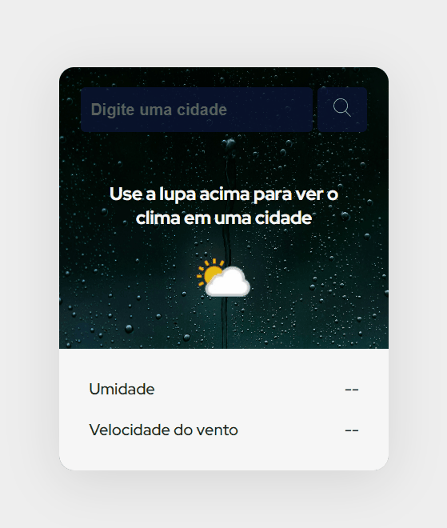

<h1 align="center"> Previsão do Tempo </h1>

 

  

## 🚀 Tecnologias

Esse projeto foi desenvolvido com as seguintes tecnologias:

- HTML e CSS
- JavaScript
- API
- Git e Github

## 💻 Projeto

Construir um aplicativo web de previsão do tempo com HTML, CSS e JS, utilizando uma API (weatherapi.com) para coletar alguns dados sobre o clima em tempo real.
 
Para utilizar a API é necessário fazer um cadastro no site https://www.weatherapi.com/para obter a key de acesso.
 
O projeto faz parte da Semana do Zero ao Programador Contratado da equipe Dev em Dobro.

---